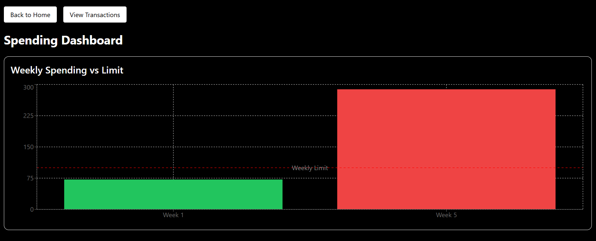

This is a [Next.js](https://nextjs.org) project bootstrapped with [`create-next-app`](https://nextjs.org/docs/app/api-reference/cli/create-next-app).

## Getting Started

### Output
Below is an example chat


## 1 Clone the repository
```bash
git clone https://github.com/devo002/Budget-Tracker.git
cd Budget-Tracker
```

### 2 Install dependencies
```bash
npm install
```

### 3 Set env vars 
Create a NEON account and get the environment variable. You can set this in the .env by DATABASE_URL=""

### 4 Run the development Server
First, run the development server:

```bash
npm run dev
```
Open [http://localhost:3000](http://localhost:3000) with your browser to see the result.


Start the Backend and set Budget and weekly spend
```bash
npx prisma generate
npx prisma studio
```

### Making Changes

You can start editing the page by modifying `app/page.tsx`. The page auto-updates as you edit the file.


## Learn More

To learn more about Next.js, take a look at the following resources:

- [Next.js Documentation](https://nextjs.org/docs) - learn about Next.js features and API.
- [Learn Next.js](https://nextjs.org/learn) - an interactive Next.js tutorial.

You can check out [the Next.js GitHub repository](https://github.com/vercel/next.js) - your feedback and contributions are welcome!

## Deploy on Vercel

The easiest way to deploy your Next.js app is to use the [Vercel Platform](https://vercel.com/new?utm_medium=default-template&filter=next.js&utm_source=create-next-app&utm_campaign=create-next-app-readme) from the creators of Next.js.

Check out our [Next.js deployment documentation](https://nextjs.org/docs/app/building-your-application/deploying) for more details.
